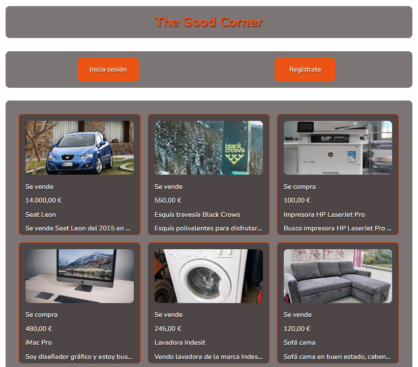

# Práctica del módulo Desarrollo Frontend con JavaScript

## Objetivo de la práctica

Consiste en desarrollar una aplicación de compra-venta a la que he llamado **`THE GOOD CORNER`**. En ella podremos ver los anuncios disponibles, y nos podremos registrar para poder crear y eliminar anuncios.

Para esto utilizaremos `sparrest.js` que nos ofrece un completo API-REST para simular un backend real y adaptarse a las necesidades de la práctica.

Se proporciona el fichero con todos los detalles de la [práctica](./Enunciado-practica.pdf).

## Instalación y configuración

Clonamos el [repositorio](https://github.com/Cespuess/practica_frontend_javascript) de la práctica en nuestro equipo.

```sh
git clone git@github.com:Cespuess/practica_frontend_javascript.git
```

Seguidamente clonaremos el repositorio [sparrest.js](https://github.com/kasappeal/sparrest.js) y haremos lo siguiente:

```sh 
git clone git@github.com:kasappeal/sparrest.js.git
```

En el directorio raíz copiaremos el fichero `db.json` del repositorio de la práctica. Una vez hecho esto, pondremos a funcionar el API REST ejecutando los siguientes comandos:

```js
npm install
```

Una vez instaladas las dependencias arrancaremos el servidor:

```js
npm start
```

## THE GOOD CORNER

> [!WARNING]  
> Para un buen funcionamiento de la página web es recomendable deshabilitar cualquier extensión bloqueadora de anuncios de vuestro navegador.

### <u>Página principal:</u>



Primero de todo tendremos una barra de navegación con dos botones, uno que nos lleva a la página para `registrarnos` y la otra para `iniciar sesión`. 

En el caso que iniciemos sesión, en su lugar nos aparecerán los botones de `Cerrar sesión` y `Crear Anuncio`.

Seguidamente tendremos la lista de productos disponibles, en la cual si hacemos click sobre un producto accederemos a la página del detalle del anuncio.

### <u>Página de registro de usuarios:</u>

En esta página tendremos el formulario de registro, el cual nos pide nuestra dirección de correo electrónico, la contraseña, y la validación de contraseña.

Una vez registrados correctamente seremos redireccionados a la página principal para poder logearnos.

### <u>Página de inicio sesión:</u>

Introducimos el correo electrónico y la contraseña para poder iniciar sesión.

### <u>Página del detalle del anuncio:</u>

Aquí encontraremos los detalles con la descripción completa del producto que hayamos hecho click en la página principal.

Si somos el usuario que ha creado el anuncio, nos mostrará un botón que nos permitirá borrar el anuncio.

### <u>Página de creación de anuncios:</u>

Encontraremos un formulario donde introduciremos los datos del anuncio que deseemos crear:

- Nombre del producto
- Precio
- Venta / Compra 
- Descripción del producto
- Foto del producto

Todos los campos son obligatorios, excepto el de la `foto del producto`.

Para la foto tendremos que indicar la URL de la imagen, o dejarlo vacío. En este caso, se le asignará una imagen por defecto.

> [!NOTE]  
> El encabezado de las páginas es también un enlace para volver a la página principal.


